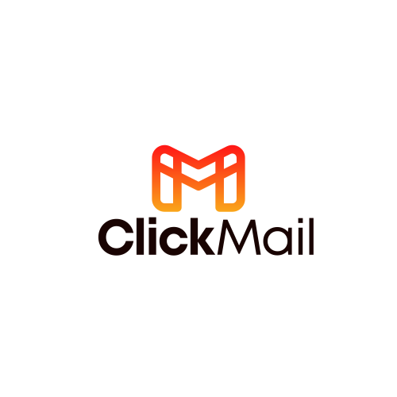

<div align="center">
  
  <h1>ClickMail 📧</h1>
  <p><strong>Email Marketing Impulsado por IA</strong></p>

  [](https://reactjs.org/)
  [](https://www.typescriptlang.org/)
  [](https://vitejs.dev/)
  [](https://tailwindcss.com/)
  [](https://click-mail.netlify.app/)

  <p>
    <a href="https://click-mail.netlify.app">Demo</a> •
    <a href="#características">Características</a> •
    <a href="#tecnologías">Tecnologías</a> •
    <a href="#instalación">Instalación</a> •
    <a href="#estructura">Estructura</a> •
    <a href="#despliegue">Despliegue</a>
  </p>
</div>

## 📋 Descripción

ClickMail es una plataforma completa de email marketing impulsada por inteligencia artificial que permite crear, personalizar y gestionar campañas de correo electrónico de manera sencilla y efectiva. Esta rama `development` contiene el **frontend** de la aplicación construido con React, TypeScript y Vite, ofreciendo una interfaz moderna e intuitiva para crear contenido de email marketing profesional con ayuda de IA.

## 🚀 Características

- **Dashboard completo**: Visualización y análisis de campañas y estadísticas
- **Generación de emails con IA**: Creación automática de contenido personalizado usando OpenAI
- **Flujo de creación de campañas**: Proceso paso a paso para definir, generar y previsualizar campañas
- **Gestión de campañas**: Edición, eliminación y seguimiento de campañas
- **Autenticación segura**: Sistema completo de registro e inicio de sesión con JWT
- **Interfaz adaptable**: Modo claro/oscuro y diseño responsivo para todos los dispositivos
- **Páginas estáticas informativas**: Características, precios, integraciones, blog, ayuda, etc.

## 🔧️ Tecnologías Utilizadas

- **React 18**: Biblioteca para construir interfaces de usuario
- **TypeScript**: Tipado estático para mejorar la calidad del código
- **Vite**: Herramienta de construcción y servidor de desarrollo rápido
- **React Router**: Navegación y enrutamiento de la aplicación
- **Tailwind CSS**: Framework CSS para diseño rápido y responsivo
- **Context API**: Gestión de estado para autenticación, tema y notificaciones
- **JWT**: Autenticación segura basada en tokens
- **Fetch API**: Comunicación con el backend

## 💻 Instalación

1. Clona el repositorio:
```bash
git clone https://github.com/joseorteha/ClickMail.git
```

2. Instala las dependencias:
```bash
cd ClickMail
npm install
```

3. Crea un archivo `.env` en la raíz del proyecto y añade tu API key de OpenAI:
```
VITE_OPENAI_KEY=tu_api_key_aquí
```

4. Inicia el servidor de desarrollo:
```bash
npm run dev
```

## 💻 Uso

1. **Registra una cuenta** o inicia sesión en la plataforma
2. **Accede al dashboard** para ver el resumen de tus campañas
3. **Crea una nueva campaña** siguiendo el proceso de 3 pasos:
   - Describe tu producto/servicio, audiencia objetivo y nombre de campaña
   - Revisa y edita los emails generados por IA
   - Previsualiza y confirma tu campaña
4. **Gestiona tus campañas** desde el dashboard
5. **Explora recursos adicionales** como plantillas, integraciones y guías

## 📁 Estructura del Proyecto

```bash
src/
├── components/         # Componentes React reutilizables
│   ├── campaign/       # Componentes específicos para campañas
│   ├── common/         # Componentes compartidos (Footer, Navbar, etc.)
│   └── dashboard/      # Componentes para la visualización de datos
├── context/           # Proveedores de contexto (Auth, Theme, Toast)
├── pages/             # Componentes de página completa
│   ├── auth/           # Páginas de autenticación
│   ├── campaign/        # Páginas relacionadas con campañas
│   ├── company/         # Páginas de información de la empresa
│   ├── product/         # Páginas de características del producto
│   ├── resources/       # Recursos (blog, plantillas, etc.)
│   └── support/         # Páginas de soporte y ayuda
├── services/          # Servicios para comunicación con API
├── utils/             # Funciones de utilidad
├── App.tsx            # Componente principal de la aplicación
└── main.tsx           # Punto de entrada de la aplicación
```

## 🌐 Despliegue

Esta rama frontend está configurada para desplegarse en [Netlify](https://www.netlify.com/):

1. La aplicación se despliega automáticamente desde la rama `development`
2. Las variables de entorno se configuran en el panel de Netlify
3. El archivo `netlify.toml` contiene la configuración para el despliegue

## 📚 Licencia

Este proyecto está licenciado bajo la Licencia MIT - ver el archivo [LICENSE](LICENSE) para más detalles.

## 🤝 Contribuciones

Las contribuciones son bienvenidas. Por favor, abre un issue primero para discutir los cambios que te gustaría hacer.

---
⭐️ Si te gusta este proyecto, ¡déjale una estrella en GitHub!
